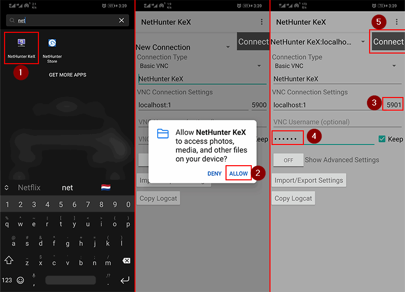

# kali-termux-android

A step-by-step guide to installing Kali Linux on a non-rooted Android device using Termux and NetHunter KeX.

## Table of Contents

- [Introduction](#introduction)
- [Requirements](#requirements)
- [Installation Steps](#installation-steps)
  - [1. Install Kali NetHunter App Store](#1-install-kali-nethunter-app-store)
  - [2. Install Termux Terminal](#2-install-termux-terminal)
  - [3. Install NetHunter KeX](#3-install-nethunter-kex)
  - [4. Install Kali Linux CLI in Termux](#4-install-kali-linux-cli-in-termux)
  - [5. Access Kali Linux Desktop](#5-access-kali-linux-desktop)
- [Screenshots](#screenshots)
- [Conclusion](#conclusion)

## Introduction

Have you ever wanted to carry the power of Kali Linux in your pocket? With this guide, you can install Kali Linux on your Android phone without rooting it. This method allows you to access Kali Linux tools and even a full desktop environment using Termux and NetHunter KeX.

## Requirements

- Android device (non-rooted)
- Internet connection
- Termux app
- NetHunter KeX app

## Installation Steps

### 1. Install Kali NetHunter App Store

- Download the [Kali NetHunter App Store](https://store.nethunter.com) APK.
- Transfer the APK to your Android device.
- Enable **Unknown Sources** in device settings.
- Install the APK.

### 2. Install Termux Terminal

- Open the Kali NetHunter App Store.
- Search for **Termux Terminal (emulator with packages)**.
- Click **Install**.
- If prompted, allow app installation from unknown sources.

### 3. Install NetHunter KeX

- Search for **NetHunter KeX** in the NetHunter App Store.
- Click **Install**.

### 4. Install Kali Linux CLI in Termux

1. Open **Termux** and update the package list:

   ```
   pkg update
   ```

2. Grant storage access:

   ```
   termux-setup-storage
   ```

3. Install `wget`:

   ```
   pkg install wget
   ```

4. Download the Kali NetHunter installation script:

   ```
   wget -O install-nethunter-termux https://offs.ec/2MceZWr
   ```

5. Make the script executable:

   ```
   chmod +x install-nethunter-termux
   ```

6. Run the script to install Kali Linux:

   ```
   ./install-nethunter-termux
   ```

7. After installation, start the Kali Linux CLI:

   ```
   nethunter
   ```

8. Get root privileges:

   ```
   sudo su
   ```

### 5. Access Kali Linux Desktop

1. Set a password for NetHunter KeX:

   ```
   nethunter kex passwd
   ```

2. Start the NetHunter desktop environment:

   ```
   nethunter kex &
   ```

3. Note the port number from the output.

4. Open **NetHunter KeX** app, enter `localhost:1` as the connection address.

5. Enter the password you set earlier and click **Connect**.

Your Kali Linux desktop is now running on your Android device!

## Screenshots

Here are some screenshots of the installation process:

- 
- 
- 
- 
- 
- 
- 
- 
- 
- 

## Conclusion

This guide provides a simple and effective way to install Kali Linux on an Android device without rooting. Whether for penetration testing, ethical hacking, or security research, you can now access the powerful tools of Kali Linux on the go.
